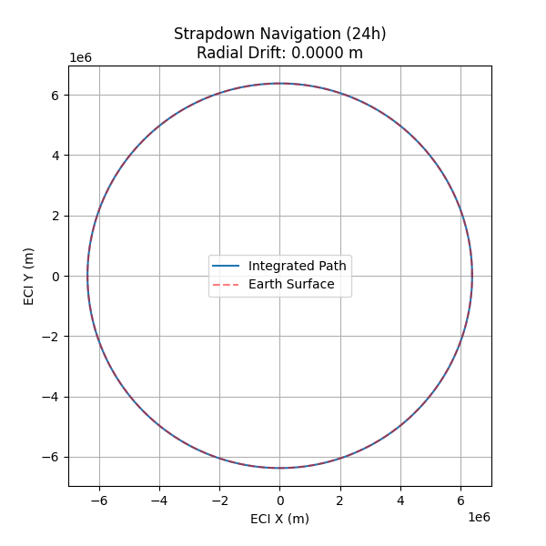
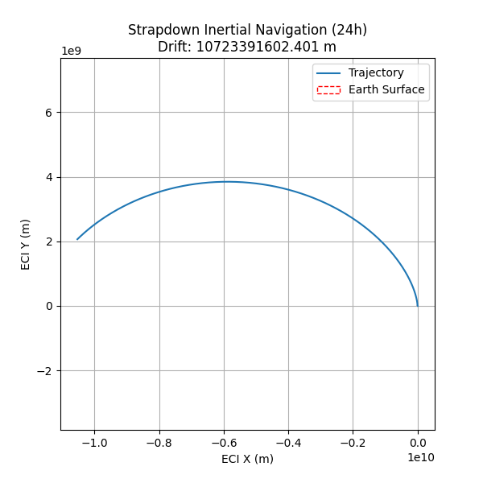

# GNC Codes

A collection of Guidance, Navigation, and Control (GNC) simulations and demonstrations built in Python.

## Contents

### 1. Strapdown INS Simulation (`IMU.py`)

A 24-hour strapdown inertial navigation system simulation that integrates IMU sensor outputs (specific force and angular rate) using RK4 to reconstruct the trajectory of a stationary observer on Earth's surface.

**Key Features:**
- Full DCM-based attitude propagation with SVD re-orthonormalization
- Gravity and centripetal acceleration modelling (WGS-84 parameters)
- Vertical channel damping (PD controller) to suppress the inherent Schuler instability
- Generates a full Earth-orbit trajectory plot in the ECI frame

**Output:**  
| | |
|:---:|:---:|
|  |  |

---

### 2. Rosenbrock Optimization (`Mission_design.py`)

Demonstrates unconstrained numerical optimization by minimizing the classic Rosenbrock "banana" function using SciPy's BFGS quasi-Newton method.

**Key Features:**
- Optimization path tracking via callback
- Logarithmic contour visualization of the objective landscape
- Convergence to the known global minimum at (1, 1)

**Output:**  


---

## Requirements

- Python 3.8+
- NumPy
- SciPy
- Matplotlib

Install dependencies:
```bash
pip install -r requirements.txt
```

## Usage

```bash
# Run the strapdown INS simulation
python IMU.py

# Run the Rosenbrock optimization demo
python Mission_design.py
```

## License

This project is licensed under the MIT License — see the [LICENSE](LICENSE) file for details.
